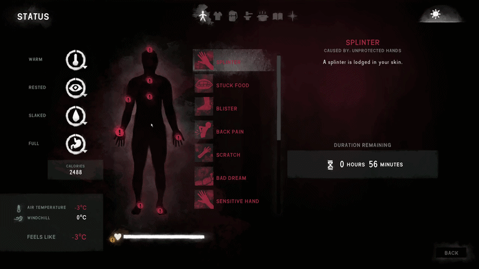

# Improved First Aid Panel

Improved First Aid Panel is a small QoL mod for The Long Dark that... well... improves the vanilla First Aid panel.

It makes the panel easier to use by adding body-area filtering and direct treatment buttons.

## How to use

- Click affected body areas to filter the affliction list by location.
- Click the same body area again to return to the full affliction list.
- Use available treatments directly from the First Aid panel with `USE` and `USE ALT` buttons.
- Works with vanilla afflictions and custom afflictions displayed in the First Aid panel.

## Preview

### Direct treatment buttons

### Body-area filtering

## Installation

Drop `ImprovedFirstAidPanel.dll` into your `Mods` folder
